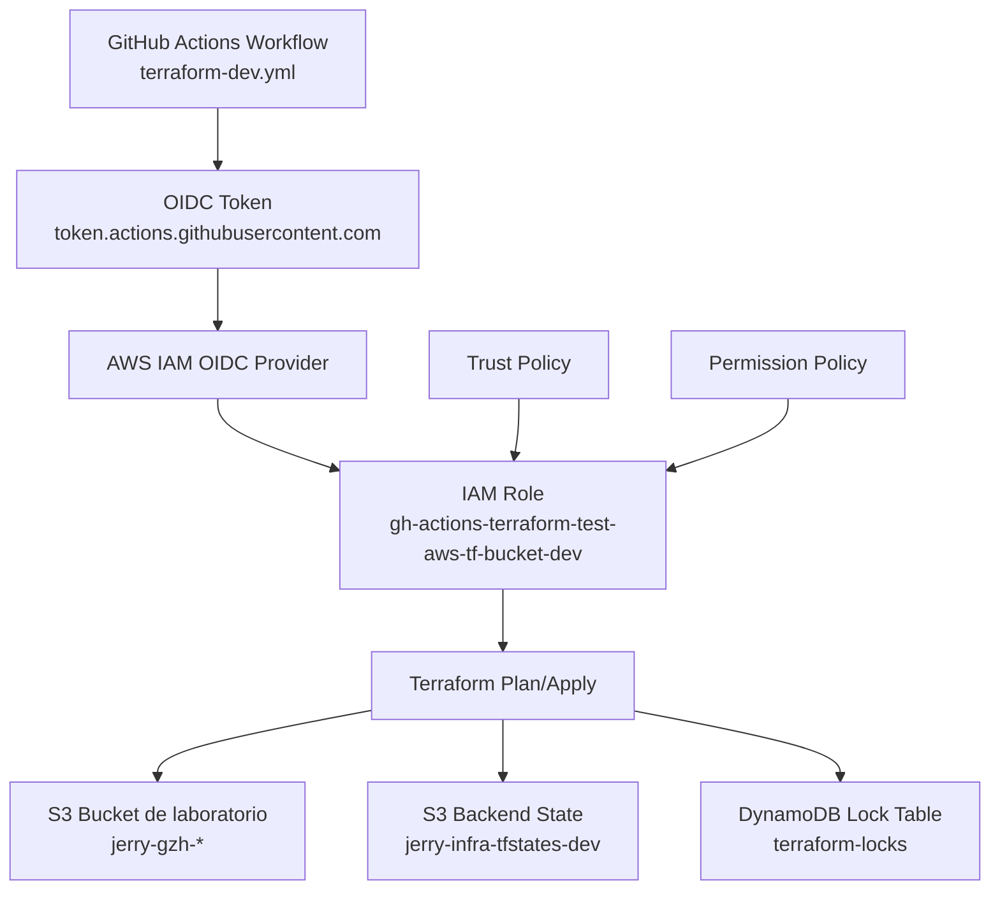

# 🚀 Terraform AWS S3 Lab (Dev)

Repositorio de infraestructura como codigo con Terraform para crear y administrar un bucket S3 en AWS, usando backend remoto en S3, locking con DynamoDB y despliegue CI/CD con GitHub Actions + OIDC.

## 🎯 Objetivo

- Crear y administrar un bucket S3 de laboratorio en `dev`.
- Guardar el estado de Terraform en backend remoto seguro.
- Ejecutar `plan` y `apply` desde GitHub Actions sin access keys estaticas.

## 🧱 Arquitectura del Proyecto

- Terraform root:
  - `versions.tf`
  - `providers.tf`
  - `variables.tf`
- Entorno dev:
  - `environments/dev/main.tf`
  - `environments/dev/backend.tf`
- CI/CD:
  - `.github/workflows/terraform-dev.yml`
- Politica IAM de ejemplo del rol CI:
  - `tf-lab-s3-dev.json`

## ✅ Prerrequisitos

- Cuenta AWS con permisos para IAM, S3 y DynamoDB.
- Repositorio en GitHub.
- Terraform `>= 1.7.0`.
- AWS CLI configurado localmente (solo para pruebas locales).

## 🛠️ Setup Inicial en Windows (Desde Cero)

Antes de trabajar con Terraform en este repositorio, instala estas herramientas base en tu equipo Windows.

### 1. 🍫 Instalar Chocolatey

Abrir **PowerShell como Administrador** y ejecutar:

```powershell
Set-ExecutionPolicy Bypass -Scope Process -Force; [System.Net.ServicePointManager]::SecurityProtocol = [System.Net.ServicePointManager]::SecurityProtocol -bor 3072; iex ((New-Object System.Net.WebClient).DownloadString('https://community.chocolatey.org/install.ps1'))
```

Validar instalacion:

```powershell
choco -v
```

### 2. 📦 Instalar Terraform

En PowerShell (idealmente como Administrador), ejecutar:

```powershell
choco install terraform -y
```

Validar instalacion:

```powershell
terraform -version
```

### 3. ☁️ Instalar AWS CLI

En PowerShell (idealmente como Administrador), ejecutar:

```powershell
choco install awscli -y
```

Validar instalacion:

```powershell
aws --version
```

## 🧭 Paso a Paso

### 1. 📁 Clonar repositorio e instalar herramientas

```bash
git clone <tu-repo>
cd test-aws-tf-bucket-
terraform -version
aws --version
```

### 2. ⚙️ Configurar provider y version de Terraform

El proyecto ya define:

- Terraform `>= 1.7.0` en `versions.tf`.
- Provider AWS `hashicorp/aws ~> 5.0` en `versions.tf`.
- Region por variable `aws_region` en `variables.tf` y `providers.tf`.

### 3. 🏗️ Definir recurso de infraestructura (dev)

En `environments/dev/main.tf` se crea el bucket S3:

```hcl
resource "aws_s3_bucket" "example" {
  bucket = "jerry-gzh-repo-a-dev-example-839406385516"
}
```

### 4. 🗄️ Configurar backend remoto de Terraform

En `environments/dev/backend.tf`:

- Bucket de state: `jerry-infra-tfstates-dev`
- Key: `test-aws-tf-bucket/dev/terraform.tfstate`
- Region: `us-east-1`
- Tabla lock: `terraform-locks`
- Encrypt: `true`

Crear previamente en AWS:

- Bucket S3 para state con versioning y bloqueo publico.
- Tabla DynamoDB `terraform-locks` con partition key `LockID` (String).

### 5. ?? Configuraciones dentro del portal AWS

En esta parte se configura **como GitHub Actions obtiene permisos temporales en AWS** sin usar access keys fijas.

Definiciones clave:

- **IAM OIDC (Identity Provider):** conecta AWS con el emisor de tokens de GitHub (`token.actions.githubusercontent.com`).
- **Rol IAM (para GitHub Actions):** identidad que asume el workflow para ejecutar `terraform plan/apply`.
- **Trust Policy (del rol):** define *quien* puede asumir el rol (OIDC + repo autorizado).
- **Policy de permisos (adjunta al rol):** define *que* acciones puede ejecutar el rol en S3/DynamoDB.

### 6. ?? Relacion entre componentes y archivos JSON de referencia

Relacion entre componentes:

1. GitHub Actions solicita un token OIDC.
2. AWS valida el token contra el Identity Provider OIDC.
3. Si la **trust policy** lo permite, AWS entrega credenciales temporales del rol.
4. El rol ejecuta Terraform con los permisos definidos en su **policy IAM** adjunta.

Tabla de referencia rapida:

| Componente | Que define | Donde se configura en AWS | Archivo de referencia |
| --- | --- | --- | --- |
| IAM OIDC Provider | Confianza entre AWS y GitHub OIDC | IAM -> Identity providers | N/A (se crea en consola AWS) |
| IAM Role (`gh-actions-terraform-test-aws-tf-bucket-dev`) | Identidad que asume GitHub Actions | IAM -> Roles | N/A (se crea en consola AWS) |
| Trust Policy del rol | Quien puede asumir el rol (`aud`/`sub`) | IAM -> Roles -> Trust relationships | [`aws_policies/gh-actions-terraform-test-aws-tf-bucket-dev.json`](aws_policies/gh-actions-terraform-test-aws-tf-bucket-dev.json) |
| Permission Policy del rol | Que acciones permite (S3, DynamoDB) | IAM -> Roles -> Permissions | [`aws_policies/tf-lab-s3-dev.json`](aws_policies/tf-lab-s3-dev.json) |

Diagrama de flujo / jerarquia:



Archivos JSON de referencia en este repositorio:

- Trust policy del rol: [`aws_policies/gh-actions-terraform-test-aws-tf-bucket-dev.json`](aws_policies/gh-actions-terraform-test-aws-tf-bucket-dev.json)
- Policy de permisos del rol (S3 + backend Terraform): [`aws_policies/tf-lab-s3-dev.json`](aws_policies/tf-lab-s3-dev.json)

> ⚠️ Nota: la carpeta `aws_policies/` normalmente **no se publica** en proyectos productivos. En este repo se incluye solo para ejemplificar como deben configurarse estos archivos.
### 7. 🤖 Configurar workflow GitHub Actions

El workflow `.github/workflows/terraform-dev.yml` ya implementa:

- Trigger en `pull_request` y en `push` a `main`.
- Job `plan` para validar y planear cambios.
- Job `apply` solo en `main`.
- Autenticacion AWS por OIDC (`id-token: write`).

### 8. 🔄 Flujo de ejecucion recomendado

1. Crear rama y cambios Terraform.
2. Abrir Pull Request.
3. Revisar resultado de `terraform plan` en Actions.
4. Hacer merge a `main`.
5. Validar `terraform apply` en Actions.

## 💻 Ejecucion Local (Opcional / Recomendado)

Desde `environments/dev`:

```bash
terraform fmt -check -recursive
terraform init -input=false
terraform validate
terraform plan -input=false
```

## 🔒 Buenas Practicas

- No commitear archivos `.tfstate` ni `.tfstate.backup`.
- Mantener permisos IAM en minimo privilegio.
- Restringir el `sub` del trust policy al repo correcto.
- Usar nombres predecibles por ambiente (`dev`, `qas`, `prd`).
- Revisar siempre el `plan` antes de aplicar.

## 🩺 Troubleshooting Rapido

- Error `AccessDenied` en `GetBucket*` durante plan:
  - Falta accion IAM de lectura S3 en el rol de GitHub Actions.
- Error en backend S3/DynamoDB:
  - Verifica permisos del bucket de state y la tabla `terraform-locks`.
- El workflow no corre:
  - Verifica rutas en `paths` dentro de `.github/workflows/terraform-dev.yml`.

