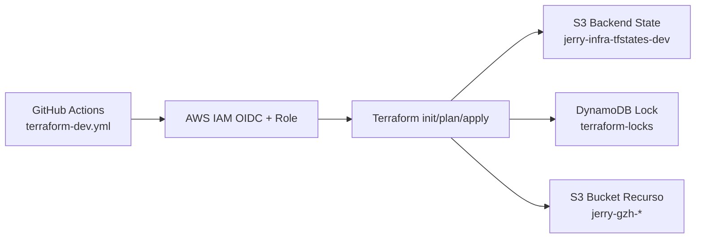
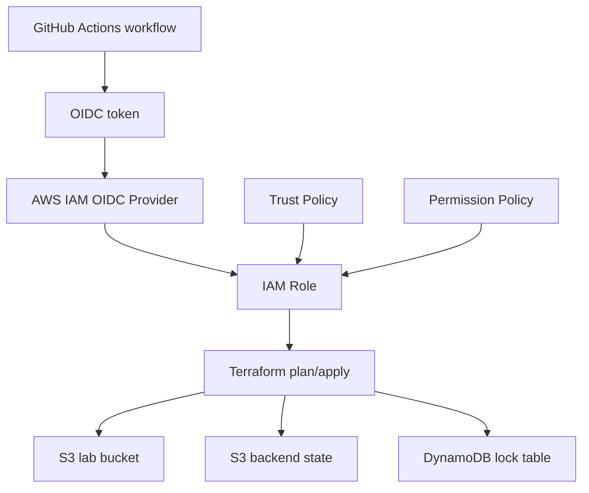

# 🚀 Terraform AWS S3 Lab (Dev)

Repositorio de ejemplo para crear y administrar un bucket S3 con Terraform, usando:

- Backend remoto en S3 para guardar state.
- Locking en DynamoDB para evitar ejecuciones simultáneas.
- GitHub Actions + OIDC para `plan` y `apply` sin access keys estáticas.

## 🎯 Objetivo

- Estandarizar infraestructura como código (IaC).
- Ejecutar cambios de forma segura con Pull Request.
- Enseñar un flujo base de DevOps para equipos principiantes.

## 🧱 Estructura del proyecto

```text
test-aws-tf-bucket-/                                        # Raíz del proyecto Terraform
├── .github/                                                # Configuración de GitHub
│   ├── dependabot.yml                                      # Configuración de actualizaciones automáticas (Dependabot)
│   └── workflows/                                          # Pipelines CI/CD
│       ├── terraform-dev.yml                               # Workflow principal: plan/apply para entorno dev
│       ├── lint.yml                                        # Validaciones de calidad: fmt, validate y tflint
│       ├── code-scanning.yml                               # Escaneo de seguridad IaC con Trivy + SARIF
│       └── codeql.yml                                      # Análisis de seguridad para workflows (CodeQL)
├── aws_policies/                                           # Policies IAM de ejemplo para OIDC y permisos
│   ├── gh-actions-terraform-test-aws-tf-bucket-dev.json   # Trust policy del rol asumido por GitHub Actions
│   └── tf-lab-s3-dev.json                                  # Permission policy (S3 + DynamoDB + backend)
├── environments/                                           # Configuración por ambiente
│   ├── dev/
│   │   └── backend.hcl                                     # Backend remoto de dev (bucket/key/lock table)
│   ├── qas/
│   │   └── backend.hcl                                     # Backend remoto de qas
│   └── prd/
│       └── backend.hcl                                     # Backend remoto de prd
├── modules/
│   └── s3_bucket/
│       ├── main.tf                                         # Recurso S3 reusable
│       ├── variables.tf                                    # Inputs del módulo
│       └── outputs.tf                                      # Outputs del módulo
├── variables/
│   ├── global.auto.tfvars                                  # Variables globales comunes a todos los ambientes
│   ├── env-dev.tfvars                                      # Variables del ambiente dev
│   ├── env-qas.tfvars                                      # Variables del ambiente qas
│   └── env-prd.tfvars                                      # Variables del ambiente prd
├── .tflint.hcl                                             # Reglas de TFLint para validar Terraform/AWS
├── .terraform.lock.hcl                                     # Lock de versiones de providers en el root module
├── main.tf                                                 # Root module: orquesta módulos y backend
├── outputs.tf                                              # Outputs del root module
├── providers.tf                                            # Configuración del provider AWS
├── variables.tf                                            # Variables de entrada del proyecto
└── versions.tf                                             # Versión de Terraform y providers requeridos
```

> ⚠️ Nota: la carpeta `aws_policies/` normalmente no se publica en proyectos productivos. En este repo se incluye solo para ejemplificar cómo deben verse estos archivos.

## ✅ Prerrequisitos

- Cuenta AWS con permisos para IAM, S3 y DynamoDB.
- Acceso al repositorio en GitHub.
- Windows + PowerShell.
- Terraform `>= 1.7.0`.

## 🧑‍🏫 Onboarding para principiantes (7 pasos)

### 1. Antes de empezar (cuentas y accesos)

- Usar usuario IAM (no root), idealmente con MFA.
- Confirmar acceso a AWS y al repositorio GitHub.
- Confirmar permisos para crear/editar IAM, S3 y DynamoDB.

### 2. Setup local en Windows

#### 2.1 Instalar Chocolatey

Ejecutar en PowerShell como administrador:

```powershell
Set-ExecutionPolicy Bypass -Scope Process -Force; [System.Net.ServicePointManager]::SecurityProtocol = [System.Net.ServicePointManager]::SecurityProtocol -bor 3072; iex ((New-Object System.Net.WebClient).DownloadString('https://community.chocolatey.org/install.ps1'))
choco -v
```

#### 2.2 Instalar Terraform

```powershell
choco install terraform -y
terraform -version
```

#### 2.3 Instalar AWS CLI

```powershell
choco install awscli -y
aws --version
```

### 3. Configurar AWS CLI local

```bash
aws configure
aws sts get-caller-identity
```

### 4. Crear backend remoto de Terraform (obligatorio antes de `init`)

- Bucket state: `jerry-infra-tfstates-dev`
- Key: `test-aws-tf-bucket/dev/terraform.tfstate`
- Region: `us-east-1`
- Tabla lock: `terraform-locks`

Por qué existe cada recurso:

- **S3 state bucket**: guarda `terraform.tfstate` (la referencia de lo que Terraform administra).
- **DynamoDB lock table**: evita que dos ejecuciones modifiquen el mismo state al mismo tiempo.

Diagrama básico (backend remoto + interacción GitHub/AWS):



Cómo crearlo en consola AWS:

1. S3 -> Create bucket -> `jerry-infra-tfstates-dev` (región `us-east-1`).
2. Mantener Block Public Access habilitado.
3. Habilitar Versioning y Default Encryption.
4. DynamoDB -> Create table -> `terraform-locks`.
5. Partition key: `LockID` (String), billing mode On-demand.

Alternativa por AWS CLI:

```bash
aws s3api create-bucket --bucket jerry-infra-tfstates-dev --region us-east-1
aws s3api put-bucket-versioning --bucket jerry-infra-tfstates-dev --versioning-configuration Status=Enabled
aws s3api put-bucket-encryption --bucket jerry-infra-tfstates-dev --server-side-encryption-configuration '{"Rules":[{"ApplyServerSideEncryptionByDefault":{"SSEAlgorithm":"AES256"}}]}'
aws dynamodb create-table --table-name terraform-locks --attribute-definitions AttributeName=LockID,AttributeType=S --key-schema AttributeName=LockID,KeyType=HASH --billing-mode PAY_PER_REQUEST --region us-east-1
```

Validaciones:

```bash
aws s3api get-bucket-versioning --bucket jerry-infra-tfstates-dev --region us-east-1
aws s3api get-bucket-encryption --bucket jerry-infra-tfstates-dev --region us-east-1
aws dynamodb describe-table --table-name terraform-locks --region us-east-1
```

### 5. Configuraciones en portal AWS para GitHub Actions (OIDC + IAM)

Definiciones:

- **IAM OIDC Provider**: confianza entre AWS y `token.actions.githubusercontent.com`.
- **IAM Role**: identidad temporal asumida por GitHub Actions.
- **Trust Policy**: define quién puede asumir el rol.
- **Permission Policy**: define qué puede hacer el rol en AWS.

Relación entre componentes:

1. GitHub Actions solicita token OIDC.
2. AWS valida token contra OIDC provider.
3. Si la trust policy coincide (`aud` y `sub`), AWS entrega credenciales temporales.
4. Terraform usa esas credenciales y opera según la permission policy.

Tabla de referencia:

| Componente | Qué define | Dónde se configura en AWS | Archivo de referencia |
| --- | --- | --- | --- |
| IAM OIDC Provider | Confianza AWS <-> GitHub OIDC | IAM -> Identity providers | N/A |
| IAM Role (`gh-actions-terraform-test-aws-tf-bucket-dev`) | Identidad para CI | IAM -> Roles | N/A |
| Trust Policy | Quién asume el rol (`aud`/`sub`) | IAM -> Role -> Trust relationships | [`aws_policies/gh-actions-terraform-test-aws-tf-bucket-dev.json`](aws_policies/gh-actions-terraform-test-aws-tf-bucket-dev.json) |
| Permission Policy | Acciones permitidas (S3/DynamoDB) | IAM -> Role -> Permissions | [`aws_policies/tf-lab-s3-dev.json`](aws_policies/tf-lab-s3-dev.json) |



### 6. Primera ejecución guiada (local)

```bash
git clone <tu-repo>
cd test-aws-tf-bucket-
terraform fmt -check -recursive
terraform init -input=false -reconfigure -backend-config=environments/dev/backend.hcl
terraform validate
terraform plan -input=false -var-file=variables/global.auto.tfvars -var-file=variables/env-dev.tfvars
```

### 7. Flujo diario seguro (PR -> plan -> apply)

1. Crear rama y hacer cambios.
2. Abrir Pull Request.
3. Revisar `terraform plan` en GitHub Actions.
4. Hacer merge a `main`.
5. Validar `terraform apply` (solo corre en `main`).

## 🤖 Workflow de GitHub Actions

El workflow `.github/workflows/terraform-dev.yml` ya tiene:

- Trigger en Pull Request y push a `main`.
- Job `plan` para validar cambios.
- Job `apply` condicionado a rama `main`.
- Permisos OIDC (`id-token: write`).

## 🧪 Validaciones del proyecto (CI/CD)

Estas son las validaciones automáticas configuradas en el repositorio:

1. **Terraform pipeline (`.github/workflows/terraform-dev.yml`)**
- Valida formato y sintaxis Terraform.
- Ejecuta `plan` en PR para previsualizar cambios.
- Ejecuta `apply` en `main` para aplicar cambios en AWS.

2. **Linter (`.github/workflows/lint.yml`)**
- Ejecuta `terraform fmt -check`.
- Ejecuta `terraform validate` (sin backend remoto en lint).
- Ejecuta `tflint` con reglas de Terraform/AWS para detectar malas prácticas y problemas de calidad.

3. **Code scanning IaC (`.github/workflows/code-scanning.yml`)**
- Usa Trivy para escanear configuraciones Terraform.
- Detecta riesgos de seguridad en infraestructura como código.
- Publica resultados en GitHub Security en formato **SARIF**.

4. **CodeQL (`.github/workflows/codeql.yml`)**
- Analiza seguridad del código de workflows de GitHub Actions.
- Ayuda a detectar patrones inseguros en automatizaciones CI/CD.

5. **Dependabot (`.github/dependabot.yml`)**
- Revisa dependencias de GitHub Actions y Terraform.
- Crea Pull Requests automáticos para actualizar versiones vulnerables o desactualizadas.

> Tip: todos los workflows de validación están habilitados con `workflow_dispatch`, por lo que también puedes ejecutarlos manualmente desde la pestaña **Actions**.

## 🩺 Troubleshooting rápido

- `AccessDenied` en acciones `GetBucket*`: falta permiso IAM en el rol de GitHub Actions.
- Error de backend S3/DynamoDB: revisar existencia/permisos del bucket de state y tabla lock.
- El workflow no corre: revisar filtros `paths` en `.github/workflows/terraform-dev.yml`.

## ♻️ Rollback / limpieza

Solo para entorno controlado (laboratorio dev):

```bash
terraform init -input=false -reconfigure -backend-config=environments/dev/backend.hcl
terraform plan -destroy -input=false -var-file=variables/global.auto.tfvars -var-file=variables/env-dev.tfvars
terraform destroy -auto-approve -var-file=variables/global.auto.tfvars -var-file=variables/env-dev.tfvars
```

Recomendaciones:

- Siempre revisar `plan -destroy` antes de destruir.
- No ejecutar `destroy` en ambientes productivos.
- Confirmar que no haya otra ejecución usando el mismo state.

⚠️ Advertencia de costos AWS:

- Los recursos activos generan cargos.
- Destruir laboratorios no usados evita costos innecesarios.
- Revisar AWS Billing / Cost Explorer periódicamente.

## 📖 Glosario básico

- **IaC**: Infraestructura definida por código versionado.
- **Terraform**: herramienta para crear/gestionar infraestructura.
- **Provider**: plugin de Terraform para un proveedor cloud.
- **State**: archivo de estado (`terraform.tfstate`).
- **Backend remoto**: ubicación central del state (S3 en este proyecto).
- **Lock de state**: bloqueo de concurrencia (DynamoDB en este proyecto).
- **OIDC**: autenticación federada sin claves estáticas.
- **IAM Role**: identidad temporal asumida por CI.
- **Trust Policy**: quién puede asumir el rol.
- **Permission Policy**: qué acciones puede ejecutar el rol.
- **Plan**: vista previa de cambios.
- **Apply**: ejecución real de cambios.
- **Drift**: diferencia entre Terraform y cambios manuales en cloud.
- **SARIF**: formato estándar (`Static Analysis Results Interchange Format`) para reportar hallazgos de seguridad/análisis estático en herramientas como GitHub Code Scanning.

## 📚 Referencias oficiales

### AWS

- IAM: https://docs.aws.amazon.com/IAM/latest/UserGuide/introduction.html
- IAM OIDC: https://docs.aws.amazon.com/IAM/latest/UserGuide/id_roles_providers_create_oidc.html
- S3: https://docs.aws.amazon.com/AmazonS3/latest/userguide/Welcome.html
- DynamoDB: https://docs.aws.amazon.com/amazondynamodb/latest/developerguide/Introduction.html
- AWS CLI: https://docs.aws.amazon.com/cli/latest/userguide/cli-chap-welcome.html

### Terraform

- Terraform docs: https://developer.hashicorp.com/terraform/docs
- AWS Provider: https://registry.terraform.io/providers/hashicorp/aws/latest/docs
- S3 backend: https://developer.hashicorp.com/terraform/language/backend/s3
- State: https://developer.hashicorp.com/terraform/language/state

### GitHub Actions

- GitHub Actions docs: https://docs.github.com/actions
- OIDC en GitHub Actions: https://docs.github.com/actions/deployment/security-hardening-your-deployments/about-security-hardening-with-openid-connect
- `aws-actions/configure-aws-credentials`: https://github.com/aws-actions/configure-aws-credentials

